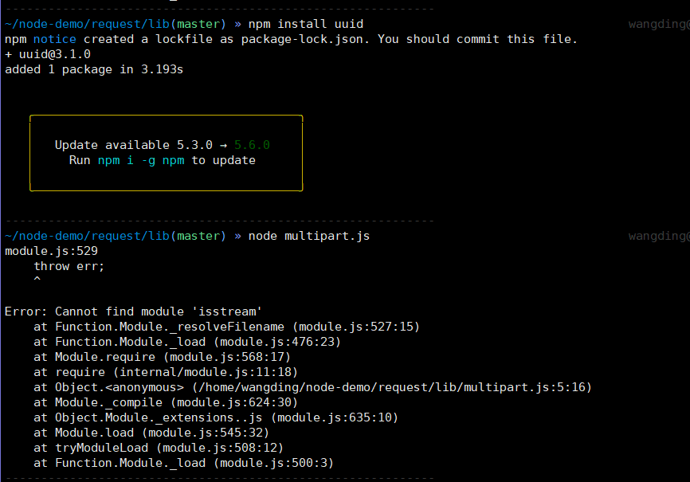
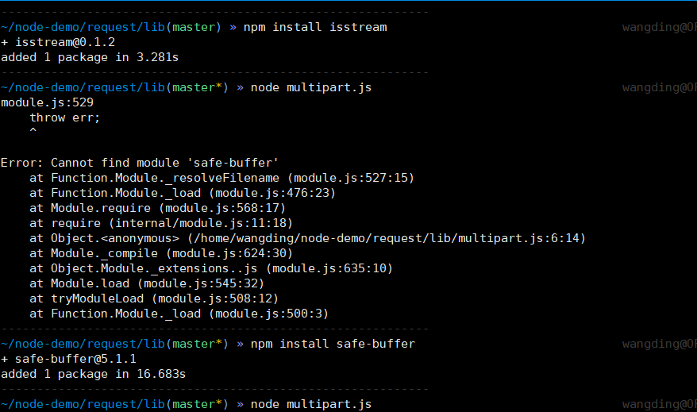
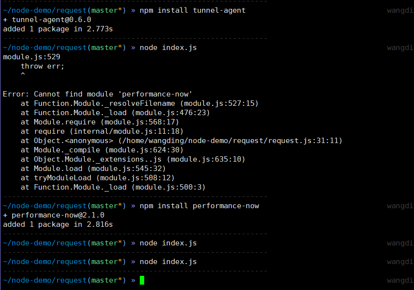

# node-multipart
# 项目 request-multipart
对于readme 关于multipart/form-data与multipart/related 的翻译
## multipart/form-data
最早的HTTP POST是不支持文件上传的，给编程开发带来很多问题。但是在1995年，ietf出台了rfc1867,也就是《RFC 1867 -Form-based File Upload in HTML》，用以支持文件上传。所以Content-Type的类型扩充了multipart/form-data用以支持向服务器发送二进制数据。因此发送post请求时候，表单<form>属性enctype共有二个值可选，这个属性管理的是表单的MIME编码：
 ①application/x-www-form-urlencoded(默认值)
 ②multipart/form-data
其实form表单在你不写enctype属性时，也默认为其添加了enctype属性值，默认值是enctype="application/x- www-form-urlencoded".
通过form表单提交文件操作如下：

<form method="post"action="http://w.sohu.com/t2/upload.do" enctype=”multipart/form-data”>

         <inputtype="text" name="desc">

         <inputtype="file" name="pic">

 </form>

 

浏览器将会发送以下数据：

POST /t2/upload.do HTTP/1.1

User-Agent: SOHUWapRebot

Accept-Language: zh-cn,zh;q=0.5

Accept-Charset: GBK,utf-8;q=0.7,*;q=0.7

Connection: keep-alive

Content-Length: 60408

Content-Type:multipart/form-data; boundary=ZnGpDtePMx0KrHh_G0X99Yef9r8JZsRJSXC

Host: w.sohu.com

 

--ZnGpDtePMx0KrHh_G0X99Yef9r8JZsRJSXC

Content-Disposition: form-data;name="desc"

Content-Type: text/plain; charset=UTF-8

Content-Transfer-Encoding: 8bit

 

[......][......][......][......]...........................

--ZnGpDtePMx0KrHh_G0X99Yef9r8JZsRJSXC

Content-Disposition: form-data;name="pic"; filename="photo.jpg"

Content-Type: application/octet-stream

Content-Transfer-Encoding: binary

 

[图片二进制数据]

--ZnGpDtePMx0KrHh_G0X99Yef9r8JZsRJSXC--


选择了这个边界之后，浏览器便把它放在Content-Type 里面传递给服务器，服务器根据此边界解析数据。下面的数据便根据boundary划分段，每一段便是一项数据。(每个field被分成小部分，而且包含一个value是"form-data"的"Content-Disposition"的头部；一个"name"属性对应field的ID,等等，文件的话包括一个filename)

IE和Chrome在filename的选择策略上有所不同，前者是文件的完整路径，而后者则仅仅是文件名。
数据内容以两条横线结尾，并同样以一个换行结束。在网络协议中一般都以连续的CR、LF（即\r、\n，或0x0D、Ox0A）字符作为换行，这与Windows的标准一致。如果您使用其他操作系统，则需要考虑它们的换行符。
另外Content-length 指的是所用数据的长度。

## multipart/related
●  multipart/related类型
  MIME邮件中除了可以携带各种附件外，还可以将其它内容以内嵌资源的方式存储在邮件中。比如我们在发送html格式的邮件内容时，可能使用图像作为 html的背景，html文本会被存储在alternative段中，而作为背景的图像则会存储在multipart/related类型定义的段中。基本格式如下：
Content-Type： multipart/related;
                 type="multipart/alternative";
                 boundary="{分段标识}"
## http协议对mime类型有详细描述，multipart/....是单个消息头包含多个消息体的解决方案。multipart媒体类型对发送非文本的各媒体类型是有用的。 
# 代码效果展示



因为代码实现的是一种功能  多数据请求功能
```js
 'use strict'   //使用严格模式   多路径请求

var uuid = require('uuid') 
var CombinedStream = require('combined-stream') 一个  combined-stream
var isstream = require('isstream') 
var Buffer = require('safe-buffer').Buffer
//运行需要的一些功能
function Multipart (request) {
  this.request = request
  this.boundary = uuid()
  this.chunked = false
  this.body = null
}
//赋值
Multipart.prototype.isChunked = function (options) {
  var self = this
  var chunked = false
  var parts = options.data || options
//运行块
  if (!parts.forEach) {
    self.request.emit('error', new Error('Argument error, options.multipart.'))
  }

  if (options.chunked !== undefined) {
    chunked = options.chunked
  }

  if (self.request.getHeader('transfer-encoding') === 'chunked') {
    chunked = true
  }

  if (!chunked) {
    parts.forEach(function (part) {
      if (typeof part.body === 'undefined') {
        self.request.emit('error', new Error('Body attribute missing in multipart.'))
      }
      if (isstream(part.body)) {
        chunked = true
      }
    })
  }

  return chunked
}
//运行此模块的情况判定
Multipart.prototype.setHeaders = function (chunked) {
  var self = this

  if (chunked && !self.request.hasHeader('transfer-encoding')) {
    self.request.setHeader('transfer-encoding', 'chunked')
  }

  var header = self.request.getHeader('content-type')

  if (!header || header.indexOf('multipart') === -1) {
    self.request.setHeader('content-type', 'multipart/related; boundary=' + self.boundary)
  } else {
    if (header.indexOf('boundary') !== -1) {
      self.boundary = header.replace(/.*boundary=([^\s;]+).*/, '$1')
    } else {
      self.request.setHeader('content-type', header + '; boundary=' + self.boundary)
    }
  }
}

Multipart.prototype.build = function (parts, chunked) {
  var self = this
  var body = chunked ? new CombinedStream() : []

  function add (part) {
    if (typeof part === 'number') {
      part = part.toString()
    }
    return chunked ? body.append(part) : body.push(Buffer.from(part))
  }

  if (self.request.preambleCRLF) {
    add('\r\n')
  }

  parts.forEach(function (part) {
    var preamble = '--' + self.boundary + '\r\n'
    Object.keys(part).forEach(function (key) {
      if (key === 'body') { return }
      preamble += key + ': ' + part[key] + '\r\n'
    })
    preamble += '\r\n'
    add(preamble)
    add(part.body)
    add('\r\n')
  })
  add('--' + self.boundary + '--')

  if (self.request.postambleCRLF) {
    add('\r\n')
  }

  return body
}
//主体
Multipart.prototype.onRequest = function (options) {
  var self = this

  var chunked = self.isChunked(options)
  var parts = options.data || options

  self.setHeaders(chunked)
  self.chunked = chunked
  self.body = self.build(parts, chunked)
}

exports.Multipart = Multipart```


## 代码运行并没有什么结果而是完成post提交功能


                 
